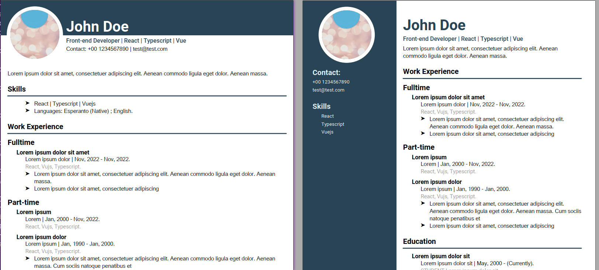

# CV Generator

CV generator combining a json data file and a xml template with the [Jinja2 template engine](https://jinja.palletsprojects.com/) and [z3c](https://github.com/zopefoundation/z3c.rml) (an alternative to ReportLab's RML PDF generation XML format) to generate a customizables Curriculum vitae pdfs.


## Install

To handle the packages this project use `pipenv`, so you can install it:

```
$ pip install --user pipx
$ pipx install pipenv
```

And with `pipenv` installed only you need go to the repositorie root and use `pipenv install`.
```
$ cd /path-to-cv-generator
$ pipenv install
```

## Quick Start

First create a custom name subdirectory inside of `/data`, check the `sample` structure:

```
data/
└── sample
    ├── data.js
    └── img
```

In `data.js` is where all your cv data will be stored. And inside `./data/sample/img` you can store the custom img that you need like your profile picture. See the data Reference to know how structure your data.

To see the help guide:

```
$ pipenv shell
(cv-generator)$ python main.py --help
usage: cv-generator [-h] [-o [FILE]] [-t [TEMPLATE_NAME]] [input_data]

positional arguments:
  input_data            Path where data.json is stored

optional arguments:
  -h, --help            show this help message and exit
  -o [FILE], --output [FILE]
                        PDF Filename that will be stored inside ./output/
  -t [TEMPLATE_NAME], --template [TEMPLATE_NAME]
                        xml file name to use like template. It should be stored inside ./templates/
```


## Example

Test the [sample data](./data/sample/data.json), the default template is [cv-one-column-default.xml](./templates/cv-one-column-default.xml).

```
$ pipenv shell
# Default template
(cv-generator)$ python main.py -o sample_cv_one_column
sample_cv_one_column.pdf was successful created in output/sample_cv_one_column.pdf

# Specify a custom template inside ./templates/
(cv-generator)$ python main.py -o sample_cv_two_column -t cv-two-columns.xml
sample_cv_two_column.pdf was successful created in output/sample_cv_two_column.pdf
```

The output pdfs looks similar to the imagen below.


You can review them in [sample_cv_one_column.pdf](./output/sample_cv_one_column.pdf) and [sample_cv_two_column.pdf)](./output/sample_cv_two_column.pdf)


## Learn more

Read the [wiki](https://github.com/xmagor/cv-generator/wiki) to know how structure your data and how create custom templates.


## References

- [Jinja2](https://jinja.palletsprojects.com/)
- [pipenv](https://pipenv.pypa.io/en/latest/)
